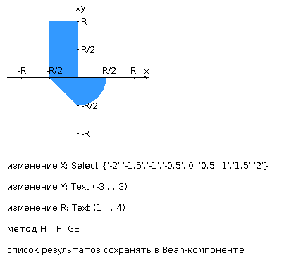

# Web programming lab 2

[Result on heruko.com](https://dokerplp-web-lab2.herokuapp.com)

Or you can check actual version in [Environments](https://github.com/dokerplp/web-lab2/deployments) 

## Functional

* You can fill form and send it to the php script
  * If you fill something wrong you will get error window
  * Else the result of script will be shown in a table
* If you input R value you can click on the picture, program will understand your coordinates, show dot on the picture and show you result in a table

## Task ##

### Разработать веб-приложение на базе сервлетов и JSP, определяющее попадание точки на координатной плоскости в заданную область.

Приложение должно быть реализовано в соответствии с [шаблоном MVC](https://en.wikipedia.org/wiki/Model–view–controller) и состоять из следующих элементов:

* **ControllerServlet**, определяющий тип запроса, и, в зависимости от того, содержит ли запрос информацию о координатах точки и радиусе, делегирующий его обработку одному из перечисленных ниже компонентов. Все запросы внутри приложения должны передаваться этому сервлету (по методу GET или POST в зависимости от варианта задания), остальные сервлеты с веб-страниц напрямую вызываться не должны.

* **AreaCheckServlet**, осуществляющий проверку попадания точки в область на координатной плоскости и формирующий HTML-страницу с результатами проверки. Должен обрабатывать все запросы, содержащие сведения о координатах точки и радиусе области.

* **Страница JSP**, формирующая HTML-страницу с веб-формой. Должна обрабатывать все запросы, не содержащие сведений о координатах точки и радиусе области.
Разработанная страница JSP должна содержать:

- "Шапку", содержащую ФИО студента, номер группы и номер варианта.

- Форму, отправляющую данные на сервер.

- Набор полей для задания координат точки и радиуса области в соответствии с вариантом задания.

- Сценарий на языке JavaScript, осуществляющий валидацию значений, вводимых пользователем в поля формы.

- Интерактивный элемент, содержащий изображение области на координатной плоскости (в соответствии с вариантом задания) и реализующий следующую функциональность:
  - Если радиус области установлен, клик курсором мыши по изображению должен обрабатываться JavaScript-функцией, определяющей координаты точки, по которой кликнул пользователь и отправляющей полученные координаты на сервер для проверки факта попадания.

- В противном случае, после клика по картинке должно выводиться сообщение о невозможности определения координат точки.

- После проверки факта попадания точки в область изображение должно быть обновлено с учётом результатов этой проверки (т.е., на нём должна появиться новая точка).

* Таблицу с результатами предыдущих проверок. Список результатов должен браться из контекста приложения, HTTP-сессии или Bean-компонента в зависимости от варианта.

### Страница, возвращаемая AreaCheckServlet, должна содержать:

* Таблицу, содержащую полученные параметры.
 
* Результат вычислений - факт попадания или непопадания точки в область.

* Ссылку на страницу с веб-формой для формирования нового запроса.

Разработанное веб-приложение необходимо развернуть на сервере [WildFly](https://www.wildfly.org). Сервер должен быть запущен в standalone-конфигурации, порты должны быть настроены в соответствии с выданным portbase, доступ к http listener'у должен быть открыт для всех IP.

## Image 

