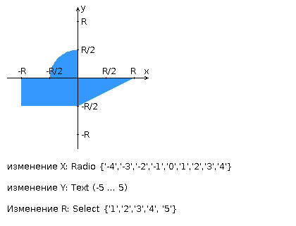

# Web programming lab 1

[Result on se.ifmo.ru](https://se.ifmo.ru/~s311769/web_lab1/)

## Functional

* You can fill form and send it to the php script
  * If you fill something wrong you will get error window
  * Else the result of script will be shown in a table
* If you input R value you can click on the image, program will understand your coordinates and show you result in a table

## Task ##

Разработать PHP-скрипт, определяющий попадание точки на координатной плоскости в заданную область, и создать HTML-страницу, которая формирует данные для отправки их на обработку этому скрипту.

Параметр R и координаты точки должны передаваться скрипту посредством HTTP-запроса. Скрипт должен выполнять валидацию данных и возвращать HTML-страницу с таблицей, содержащей полученные параметры и результат вычислений - факт попадания или непопадания точки в область. Предыдущие результаты должны сохраняться между запросами и отображаться в таблице.

Кроме того, ответ должен содержать данные о текущем времени и времени работы скрипта.

**Разработанная HTML-страница должна удовлетворять следующим требованиям:**

* Для расположения текстовых и графических элементов необходимо использовать блочную верстку.

* Данные формы должны передаваться на обработку посредством GET-запроса.

* Таблицы стилей должны располагаться в отдельных файлах.

* При работе с CSS должно быть продемонстрировано использование селекторов идентификаторов, селекторов потомств, селекторов псевдоклассов, селекторов атрибутов а также такие свойства стилей CSS, как наследование и каскадирование.

* HTML-страница должна иметь "шапку", содержащую ФИО студента, номер группы и новер варианта. При оформлении шапки необходимо явным образом задать шрифт (fantasy), его цвет и размер в каскадной таблице стилей.

* Отступы элементов ввода должны задаваться в процентах.

* Страница должна содержать сценарий на языке JavaScript, осуществляющий валидацию значений, вводимых пользователем в поля формы. Любые некорректные значения (например, буквы в координатах точки или отрицательный радиус) должны блокироваться.

## Image 

